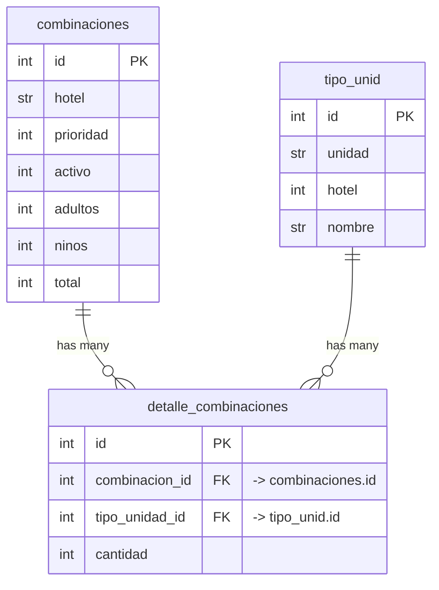

# Room Combinations — Table Relationships

`detalle_combinaciones` is a **junction table** with an extra column (`cantidad`),
so `combinaciones` and `tipo_unid` are **many-to-many** through it
(association-object pattern).

## Cardinality

| From | | To |
|------|---|----|
| one `combinaciones` row | → many | `detalle_combinaciones` rows |
| one `tipo_unid` row | → many | `detalle_combinaciones` rows |
| `combinaciones` | ↔ many-to-many ↔ | `tipo_unid` (via `detalle_combinaciones`) |

## ORM mapping (`app/models.py`)

- `Combination.details` → `list[Detail]`  (one side)
- `Unit.details` → `list[Detail]`  (one side)
- `Detail.combination` → `Combination`  (many side, scalar)
- `Detail.unit` → `Unit`  (many side, scalar)
